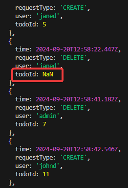

# playwright-playwright-framework

## Table of Contents

- [Short description](#environments)
- [Setting Playwright options](#setting-playwright-options)
- [Environments](#environments)
- [Test data files](#test-data-files)
- [Reports](#reports)
- [Commands](#commands)
- [Browsers](#browsers)
- [Additional information](#additional-information)

## Short description

This repository is a tool for automating end-to-end (e2e) testing of [microservice-app-example](https://github.com/elgris/microservice-app-example) product using [Playwright](https://playwright.dev/docs/intro).

## Setting Playwright options

All parameters for running tests are located in the [playwright config file](playwright.config.ts).

## Environments

To create an environment ready for testing, need to download [microservice-app-example](https://github.com/elgris/microservice-app-example), go to the root directory and run it with the command:

    docker-compose up --build

After that creating `.env` file in `playwright-framework` directory (we can use [.env.example](/.env.example/) file) and specify there the necessary environment for tests (in our case it's just `localhost`). The env address is placed in the [/config](/config/)  directory.

Now we need to install all the necessary packages to work with our framework:

    npm i
    npx playwright install chromium

## Test data files

Test data source files can be found in the  [/fixtures](/fixtures) directory. It is not a good practice to hardcode fixtures, but due to the imperfection of the service being tested and certain limitations it was decided to do just that.

## Reports

The test results, upon completion, are saved in the `playwright-report` directory. That is an [HTML report](https://playwright.dev/docs/intro#html-test-reports:~:text=After%20your%20test,the%20tests%20failed.), which consists of a list of tests with different statuses (passed, failed, skipped, flaky) and more detailed information for each. If any test fails, then in addition to the steps, the report will display a screenshot of the moment the problem occurred and a [Trace viewer](https://playwright.dev/docs/trace-viewer-intro).

## Commands 

To run test there are 2 options:

- To run tests with display in the console

      npm run test-terminal

- To run the ui version with the ability to look specific tests and understand their behavior in more detail

      npm run test-ui

- To run tests displaying only browser windows:

      npm run test-headed

To start the playwright server with test report:

    npm run report

## Browsers 

Playwright can run tests on `Chromium`, `WebKit` and `Firefox` browsers as well as branded browsers such as Google Chrome and Microsoft Edge.

In our case testing is carried out only on `Chromium`.

## Additional information

Some test cases are flaky because the operation of the service under test is imperfect. For example, when deleting a task, it may send a response with `todoId: Nan` field:

